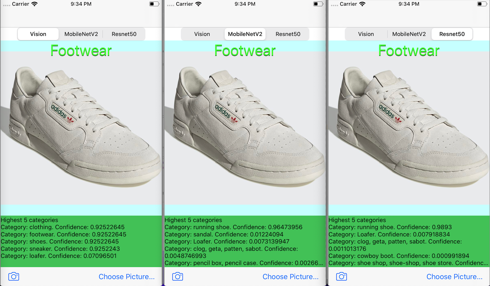
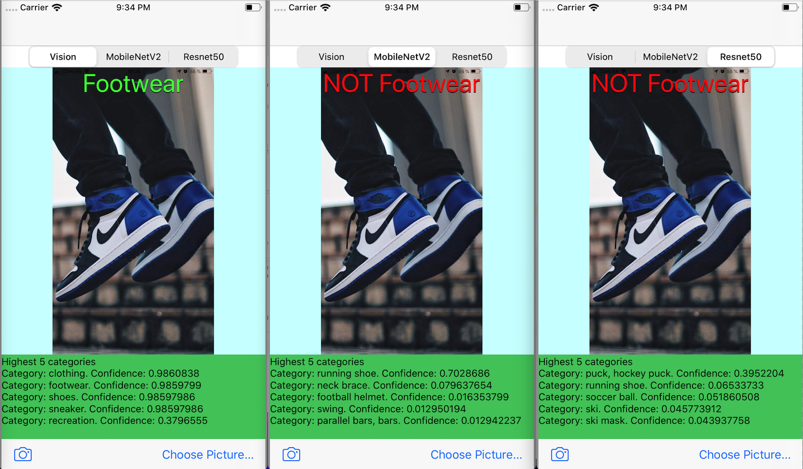

# Footwear or Not
A test iOS app that allows a user to take a picture, or use one from the photos library, and detects if it contains footwear or not.

By default the Vision Framework is used to perform the Image Classification. Other models are provided as well: MobileNetV2 and ResNet50.

Once an image has been selected, the user can choose the desired model to use to perform the Image Classification. The application identifies an image as footwear if it matches at least one of the following categories: shoes, sneaker, footwear, running shoe with a confidence above 0.9

The following screen captures show the application in action:

All Positive

Some Negatives

## Requirements
- iOS Device with iOS 13.0+
- Swift 5.0+
- Xcode 12.0+

## Install Instructions
1. Download the zip file or clone the project from [here](https://github.com/Dario-GoldenSpear/footwear-or-not)
2. Open FootwearOrNot/FootwearOrNot.xcodeproj
3. Compile and Run

NOTES:
- This project is configured to run [SwiftLint](https://github.com/realm/SwiftLint), if installed.

## Troubleshooting

